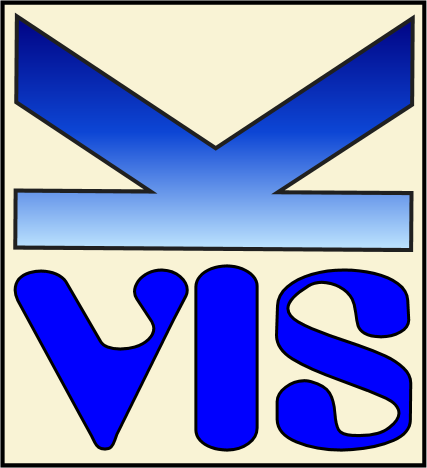
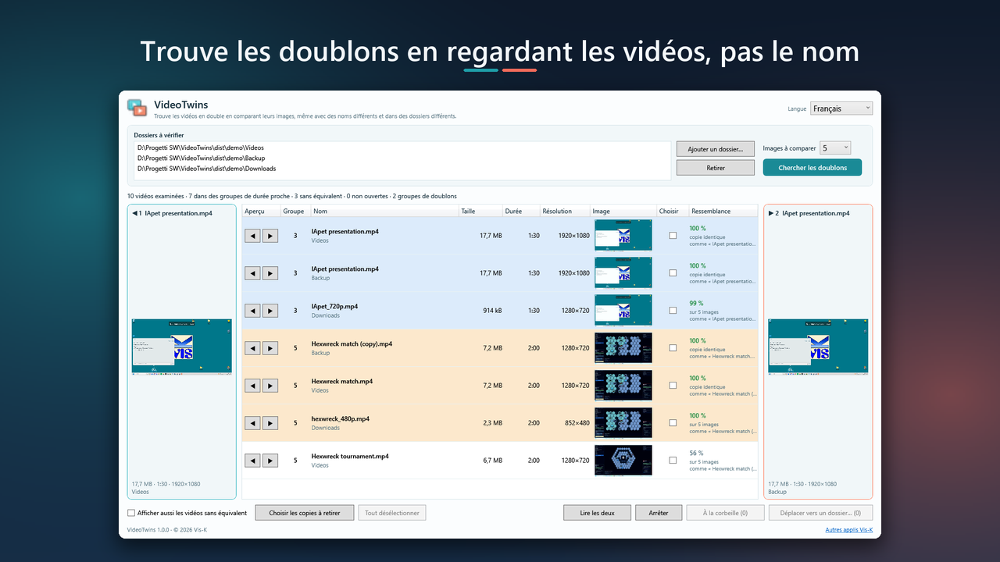

# VideoTwins

<a href="#it">Italiano</a> ·
<a href="#en">English</a> ·
<a href="#es">Español</a> ·
<a href="#fr">Français</a> ·
<a href="#de">Deutsch</a> ·
<a href="#zh">中文</a>

---

<h2 id="it">Italiano</h2>

Trova i video doppioni confrontandone i fotogrammi, anche quando hanno un altro
nome, un'altra risoluzione o stanno in un'altra cartella.

Il telefono, il vecchio disco esterno, la cartella Download, il backup di due anni fa: gli stessi
video finiscono in tre posti con tre nomi diversi. VideoTwins li ritrova guardandoli. Mette insieme
quelli che durano uguale, ne confronta fino a nove fotogrammi presi lungo tutto il video e ti dice
quanto si somigliano; le copie identiche byte per byte le riconosce come tali. Cerca in più cartelle
e più dischi insieme, e due riquadri ti fanno vedere i video fianco a fianco prima di decidere.

**Togli le copie in sicurezza.** Un clic seleziona, in ogni gruppo, tutte le copie tranne la più
definita. Poi scegli: nel cestino di Windows, da cui puoi ripescarle, o in un'altra cartella.
Chiede sempre conferma, non sovrascrive e non cancella mai niente, e fuori dalle cartelle che hai
scelto non tocca nessun file. **Le tue cose restano tue:** nessun account, nessuna telemetria,
nessuna pubblicità, nessuna connessione a Internet.

**Che cosa serve.** Windows 10 (2004) o Windows 11, 64 bit. Niente altro da installare. Interfaccia
in sei lingue.

Hai cartelle piene di documenti e video? <a href="https://apps.microsoft.com/detail/9MXM9KR8SK94">IApet</a>
è un compagno animato che vive sul desktop e, con l'IA che gira sul tuo computer, li riassume, li
descrive e ti racconta che cosa si vede nei video. <a href="https://rvisc.github.io/vis-k/">Tutte le app Vis-K</a>

**Aggiornamenti e sicurezza.** Gli aggiornamenti di sicurezza sono garantiti per cinque anni dalla
data in cui una versione è stata immessa sul mercato. Chi individua una vulnerabilità può scriverne
a <vis-k@outlook.it>: riceve conferma della segnalazione e viene tenuto informato. Chi segnala in
buona fede, senza divulgare il problema prima che sia corretto, non ha niente da temere.

<a href="https://apps.microsoft.com/detail/9PC5S6Q5XF1P">Microsoft Store</a>
· <a href="privacy.html#it">Privacy</a>
· <a href="eula.html#it">Contratto</a>

---

<h2 id="en">English</h2>

Finds duplicate videos by comparing their frames, even when they have another
name, another resolution or sit in another folder.

Your phone, the old external drive, the Downloads folder, the backup from two years ago: the same
videos end up in three places under three different names. VideoTwins finds them by looking at
them. It groups the ones with the same length, compares up to nine frames taken along the whole
video and tells you how alike they are; copies identical byte for byte are recognised as such. It
searches several folders and drives at once, and two boxes let you watch the videos side by side
before deciding.

**Remove copies safely.** One click selects, in each group, all copies except the sharpest one.
Then you choose: into the Windows Recycle Bin, where you can get them back, or into another
folder. It always asks for confirmation, never overwrites or deletes anything, and does not touch
any file outside the folders you chose. **Your things stay yours:** no account, no telemetry, no
ads, no Internet connection.

**What you need.** Windows 10 (2004) or Windows 11, 64-bit. Nothing else to install. Interface in
six languages.

Got folders full of documents and videos? <a href="https://apps.microsoft.com/detail/9MXM9KR8SK94">IApet</a>
is an animated companion living on your desktop that, with AI running on your computer, summarises
them, describes them and tells you what can be seen in your videos. <a href="https://rvisc.github.io/vis-k/">All Vis-K apps</a>

**Updates and security.** Security updates are guaranteed for five years from the date a version
was placed on the market. Anyone who finds a vulnerability can write to <vis-k@outlook.it>: they
get an acknowledgement and are kept informed. Anyone reporting in good faith, without disclosing
the problem before it is fixed, has nothing to fear.

<a href="https://apps.microsoft.com/detail/9PC5S6Q5XF1P">Microsoft Store</a>
· <a href="privacy.html#en">Privacy</a>
· <a href="eula.html#en">License</a>

---

<h2 id="es">Español</h2>

Encuentra vídeos duplicados comparando sus fotogramas, aunque tengan otro
nombre, otra resolución o estén en otra carpeta.

El teléfono, el disco externo viejo, la carpeta Descargas, la copia de seguridad de hace dos años:
los mismos vídeos acaban en tres sitios con tres nombres distintos. VideoTwins los encuentra
mirándolos. Agrupa los que duran lo mismo, compara hasta nueve fotogramas tomados a lo largo de todo
el vídeo y te dice cuánto se parecen; las copias idénticas byte a byte las reconoce como tales.
Busca en varias carpetas y discos a la vez, y dos recuadros te dejan ver los vídeos lado a lado
antes de decidir.

**Quita las copias con seguridad.** Un clic selecciona, en cada grupo, todas las copias menos la
más nítida. Luego eliges: a la papelera de Windows, de donde puedes recuperarlas, o a otra carpeta.
Siempre pide confirmación, nunca sobrescribe ni borra nada, y no toca ningún archivo fuera de las
carpetas que has elegido. **Tus cosas siguen siendo tuyas:** sin cuenta, sin telemetría, sin
publicidad, sin conexión a Internet.

**Qué necesitas.** Windows 10 (2004) o Windows 11, 64 bits. Nada más que instalar. Interfaz en seis
idiomas.

¿Tienes carpetas llenas de documentos y vídeos? <a href="https://apps.microsoft.com/detail/9MXM9KR8SK94">IApet</a>
es un compañero animado que vive en el escritorio y, con la IA que funciona en tu ordenador, los
resume, los describe y te cuenta qué se ve en tus vídeos. <a href="https://rvisc.github.io/vis-k/">Todas las apps de Vis-K</a>

**Actualizaciones y seguridad.** Las actualizaciones de seguridad están garantizadas durante cinco
años desde la fecha en que una versión se comercializó. Quien encuentre una vulnerabilidad puede
escribir a <vis-k@outlook.it>: recibe confirmación y se le mantiene al tanto. Quien informa de
buena fe, sin divulgar el problema antes de que se corrija, no tiene nada que temer.

<a href="https://apps.microsoft.com/detail/9PC5S6Q5XF1P">Microsoft Store</a>
· <a href="privacy.html#es">Privacy</a>
· <a href="eula.html#es">Contrato</a>

---

<h2 id="fr">Français</h2>

Trouve les vidéos en double en comparant leurs images, même quand elles ont un
autre nom, une autre résolution ou se trouvent dans un autre dossier.

Le téléphone, le vieux disque externe, le dossier Téléchargements, la sauvegarde d'il y a deux ans :
les mêmes vidéos finissent à trois endroits sous trois noms différents. VideoTwins les retrouve en
les regardant. Il réunit celles qui ont la même durée, compare jusqu'à neuf images prises sur toute
la vidéo et te dit à quel point elles se ressemblent ; les copies identiques octet par octet sont
reconnues comme telles. Il cherche dans plusieurs dossiers et disques à la fois, et deux cadres te
montrent les vidéos côte à côte avant de décider.

**Retire les copies en toute sécurité.** Un clic sélectionne, dans chaque groupe, toutes les copies
sauf la plus nette. Ensuite tu choisis : dans la Corbeille de Windows, d'où tu peux les récupérer,
ou dans un autre dossier. Il demande toujours confirmation, n'écrase et ne supprime jamais rien, et
ne touche à aucun fichier en dehors des dossiers choisis. **Tes affaires restent les tiennes :** pas
de compte, pas de télémétrie, pas de publicité, pas de connexion à Internet.

**Ce qu'il te faut.** Windows 10 (2004) ou Windows 11, 64 bits. Rien d'autre à installer. Interface
en six langues.

Tu as des dossiers pleins de documents et de vidéos ? <a href="https://apps.microsoft.com/detail/9MXM9KR8SK94">IApet</a>
est un compagnon animé qui vit sur le bureau et qui, avec l'IA qui tourne sur ton ordinateur, les
résume, les décrit et te raconte ce qu'on voit dans tes vidéos. <a href="https://rvisc.github.io/vis-k/">Toutes les applis Vis-K</a>

**Mises à jour et sécurité.** Les mises à jour de sécurité sont garanties pendant cinq ans à partir
de la mise sur le marché d'une version. Qui trouve une vulnérabilité peut écrire à
<vis-k@outlook.it> : un accusé de réception est envoyé et la personne est tenue informée. Qui
signale de bonne foi, sans divulguer le problème avant sa correction, n'a rien à craindre.

<a href="https://apps.microsoft.com/detail/9PC5S6Q5XF1P">Microsoft Store</a>
· <a href="privacy.html#fr">Privacy</a>
· <a href="eula.html#fr">Contrat</a>

---

<h2 id="de">Deutsch</h2>

Findet doppelte Videos, indem es ihre Bilder vergleicht – auch wenn sie anders
heißen, eine andere Auflösung haben oder in einem anderen Ordner liegen.

Das Handy, die alte externe Festplatte, der Download-Ordner, die Sicherung von vor zwei Jahren:
Dieselben Videos landen an drei Orten unter drei Namen. VideoTwins findet sie, indem es sie
ansieht. Es fasst gleich lange Videos zusammen, vergleicht bis zu neun Bilder aus dem ganzen Video
und sagt dir, wie ähnlich sie sind; Byte für Byte identische Kopien erkennt es als solche. Es sucht
in mehreren Ordnern und Laufwerken zugleich, und zwei Felder zeigen dir die Videos nebeneinander,
bevor du entscheidest.

**Kopien sicher entfernen.** Ein Klick markiert in jeder Gruppe alle Kopien außer der schärfsten.
Dann wählst du: in den Windows-Papierkorb, aus dem du sie zurückholen kannst, oder in einen anderen
Ordner. Es fragt immer nach, überschreibt und löscht nie etwas und rührt keine Datei außerhalb der
gewählten Ordner an. **Deine Sachen bleiben deine:** kein Konto, keine Telemetrie, keine Werbung,
keine Internetverbindung.

**Was du brauchst.** Windows 10 (2004) oder Windows 11, 64 Bit. Sonst nichts zu installieren.
Oberfläche in sechs Sprachen.

Ordner voller Dokumente und Videos? <a href="https://apps.microsoft.com/detail/9MXM9KR8SK94">IApet</a>
ist ein animierter Begleiter auf deinem Desktop, der sie mit einer KI auf deinem Computer
zusammenfasst, beschreibt und erzählt, was in deinen Videos zu sehen ist. <a href="https://rvisc.github.io/vis-k/">Alle Vis-K-Apps</a>

**Updates und Sicherheit.** Sicherheitsupdates sind fünf Jahre ab dem Datum garantiert, an dem eine
Version in Verkehr gebracht wurde. Wer eine Sicherheitslücke findet, kann an <vis-k@outlook.it>
schreiben: Der Eingang wird bestätigt und über den weiteren Verlauf wird informiert. Wer in gutem
Glauben meldet und das Problem vor der Behebung nicht veröffentlicht, hat nichts zu befürchten.

<a href="https://apps.microsoft.com/detail/9PC5S6Q5XF1P">Microsoft Store</a>
· <a href="privacy.html#de">Datenschutz</a>
· <a href="eula.html#de">Lizenzvertrag</a>

---

<h2 id="zh">中文</h2>

通过比较画面查找重复视频，即使它们改了名、分辨率不同或放在别的文件夹里。

手机、旧的移动硬盘、下载文件夹、两年前的备份：同样的视频散落在三个地方，有三个不同的名字。VideoTwins 通过看视频本身找到它们。它把时长相同的视频归为一组，在整个视频中比较多达九个画面，并告诉你它们有多相似；逐字节完全相同的副本，它会直接认出来。它能同时搜索多个文件夹和磁盘，两个播放框让你在决定之前并排查看视频。

**安全地移走副本。** 一键在每组中选中除最清晰的那个以外的所有副本。然后由你选择：移到 Windows 回收站（可以从那里找回），或者移到另一个文件夹。它始终先请你确认，从不覆盖或删除任何东西，也不会碰你所选文件夹之外的任何文件。**你的东西始终属于你：** 无需账户，没有遥测，没有广告，不联网。

**你需要什么。** Windows 10（2004）或 Windows 11，64 位。无需另外安装任何东西。界面支持六种语言。

文件夹里满是文档和视频？<a href="https://apps.microsoft.com/detail/9MXM9KR8SK94">IApet</a> 是住在桌面上的动画伙伴，借助在你电脑上运行的 AI 总结、描述它们，并告诉你视频里能看到什么。<a href="https://rvisc.github.io/vis-k/">所有 Vis-K 应用</a>

**更新与安全。** 安全更新自某一版本投放市场之日起提供五年。发现安全漏洞的人可以写信到
<vis-k@outlook.it>：你会收到确认，并被告知处理的进展。善意报告、并且在漏洞修复前不予公开的人，
不必有任何顾虑。

<a href="https://apps.microsoft.com/detail/9PC5S6Q5XF1P">Microsoft Store</a>
· <a href="privacy.html#zh">Privacy</a>
· <a href="eula.html#zh">许可协议</a>

---

Rosario Viscardi — <vis-k@outlook.it>

&copy; 2026 Vis-K
